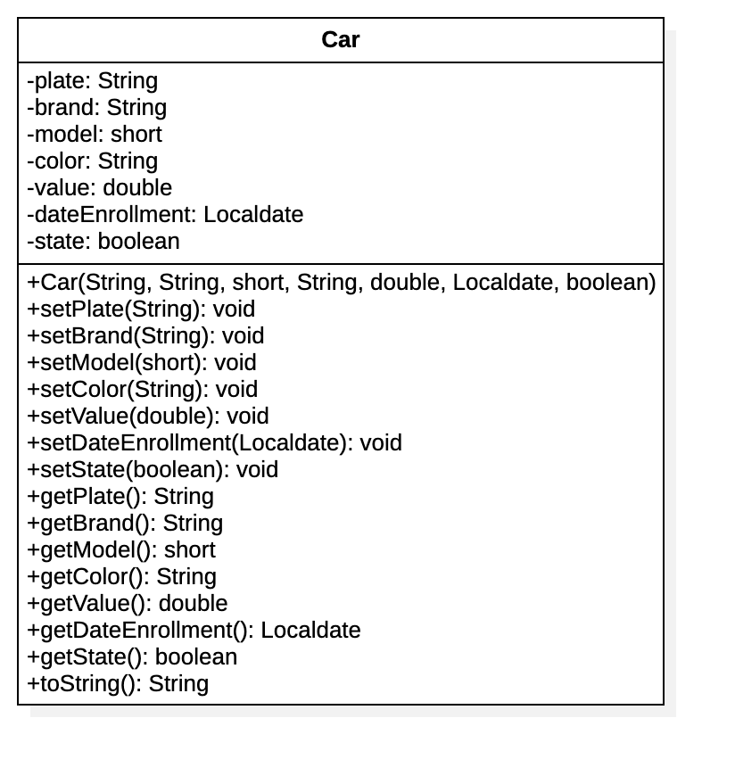

# Gestión de Objetos JSON con Gson de Google

## JSON

Acrónimo de __Javascript Object Notation__ es un formato de texto sencillo para el intercambio de datos. Es un subconjunto de la notación literal de Objetos de Javascript y se ha adoptado como una alternativa al formato `xml` para transferir datos en Internet. Los valores se expresan en formato ___clave:valor___ separados por coma (,). Un objeto se describe entre llaves así:

```json
    {
        plate: "JIA764",
        brand: "Renault",
        model: 1977,
        color: "Verde",
        value: 2300000,
        dateEnrollment: {
            year:1977,
            month:11,
            day:17
        },
        state: false,
    }
```

### Tipos de Datos

- Números: Representan valores numéricos positivos o negativos y pueden contener parte fraccionaria.
- Cadenas de Caracteres: Representan secuencias de caracteres alfanuméricos, se expresan entre comillas
- Booleanos: Representan valores lógicos, se expresan como `true` o `false`
- null: Representan un valor nullo
- Arreglos: Representan listas de cero o más valores de cualquier tipo separados por comas, dentro de un arreglo se pueden tener valores que representan objetos 


## Librería Gson

Gson es una API en Java, desarrollada por Google, es utilizada para convertir objetos Java a JSON (Serialización) y JSON a objetos Java (deserialización). La librería estructura los componentes de la siguiente manera:

- __JsonElement__: Clase que representa cualquier elemento JSON que puede ser de alguno de los siguientes cuatro tipos:

1. __JsonObject__: Clase que representa un objeto de JSON, es decir, un conjunto de pares clave-valor.
1. __JsonArray__: Clase que representa un arreglo o colección de JSON. Es una lista de __JsonElements__ cada uno de los cuales puede ser de un tipo diferente.
1. __JsonPrimitive__: Clase que representa un tipo de dato primitivo u objeto de datos simple.
1. __JsonNull__: Representa un objeto null.

Para poder usar la librería es necesario adionarla al proyecto en Java, se puede adicionar como dependencias del proyecto usando un gestor:

###### Gradle

```json
dependencies{
    compile group: 'com.google.code.gson', name: 'gson', version: '2.8.6'
}
```

###### Maven

```xml
<dependency>
    <groupid>com.google.code.gson</groupid>
    <artifactid>gson</artifactid>
    <version>2.8.6</version>
</dependency>
```

>Si no se usa un gestor de dependencias, agregar el archivo .jar al proyecto, según el IDE que se esté utilizando

## Ejemplos con Java

En la carpeta `lib` se encuentra para descarga el archivo __.jar__ de la librería __gson-2.8.6__. 

Para el ejemplo se usarán instancias de la siguiente clase:



###  Serializando un Objeto de java

El siguiente código en Java crea un objeto de la clase `Car`, lo serializa como un objeto JSON y los visualiza.

```java
 Car renault = new Car("JIA764","Renault 4",(short)1977,"Verde",2_300_000,false, LocalDate.of(1996, Month.NOVEMBER,17));

        String json = new Gson().toJson( renault );

        System.out.println( json );
```

> En la salida se debe observar que el atributo de fecha de matrícula (dateEnrollment) se convierte como un objeto JSON dentro del miusmo objeto JSON

Si se desea presentar la salida en un formato bonito (con saltos de línea), se usa una instancia de la  clase `GsonBuilder` que extiende a la clase `Gson`. En el siguiente código se ilustra lo anterior.

```java
Gson jsonPretty = new GsonBuilder().setPrettyPrinting().create();

System.out.println( jsonPretty.toJson( renault ) );
```

###  Serializando una colección de Objetos

En el siguiente ejemplo se encuentra el código en Java que crea una colección de objetos y los serializa como una colección de objetos JSON

```java
List<Car> cars = Arrays.asList(new Car("JIA764","Renault 4",(short)1977,"Verde",2_300_000,false, LocalDate.of(1996, Month.NOVEMBER,17)),
                new Car("JJJ708","Renault 9",(short)1989,"Azul",10_400_000,true, LocalDate.of(1988, Month.JUNE,25)),
                new Car("NOT560","Chevrolet Aveo",(short)2007,"Rojo",27_000_000,true, LocalDate.of(2007, Month.FEBRUARY,05)),
                new Car("DZW615","Kia Picanto",(short)2018,"Gris",28_000_000,true, LocalDate.of(2017, Month.AUGUST,25)));

String jsonCars = jsonPretty.toJson( cars );
System.out.println( jsonCars );
```

> Observar que en la salida la colección se especifica entre paréntesis cuadrados ([ ]), dentro de los cuales cada objeto se especifica entre llaves ({ })

### Deserializando un Objeto JSON

A partir de un Elemento JSON, es posible obtener una instancia de una clase en Java. El elemento JSON se especifica como una cadena de texto con los valores en formato _clave-valor_. El siguiente ejemplo se crea un objeto JSON y se deserializa a un objeto de la clase Car

```java
String strCar = "{\"plate\":\"DZW737\"," +
                "\"brand\":\"Chevrolet Corsa Evolution\"," +
                "\"model\":2004," +
                "\"color\":\"Verde\"," +
                "\"value\":12500000," +
                "\"dateEnrollment\":{\"year\":2005,\"month\":04,\"day\":28}," +
                "\"state\":true}";

Car corsa = new Gson().fromJson( strCar, Car.class );

System.out.println( corsa );
```

> Las comillas dobles que describen el nombre de los atributos se deben escapar (\\")

### Deserializando una colección de Objetos JSON

En el siguiente ejemplo se crea una colección de objetos JSON y se deserializan a un ArrayList<Car> de  Java

```java
String strCars = "[{\"plate\":\"DZW737\"," +
                "\"brand\":\"Chevrolet Corsa Evolution\"," +
                "\"model\":2004," +
                "\"color\":\"Verde\"," +
                "\"value\":12500000," +
                "\"dateEnrollment\":{\"year\":2005,\"month\":04,\"day\":28}," +
                "\"state\":true}," +
                "{\"plate\":\"WLZ398\"," +
                "\"brand\":\"Mazda CX5\"," +
                "\"model\":2016," +
                "\"color\":\"Rojo\"," +
                "\"value\":78000000," +
                "\"dateEnrollment\":{\"year\":2017,\"month\":01,\"day\":10}," +
                "\"state\":true}]";

        Type typeList = new TypeToken<List<Car>>(){}.getType();
        List<Car> newCars = new Gson().fromJson(strCars, typeList );
        System.out.printf("Se han deserializado %d Objetos%n",newCars.size());
        newCars.forEach( car -> System.out.println( car ) );
```

> Tener en cuenta que para `Type` se debe importar de `java.lang.reflect.Type` y `TypeToken` de `com.google.gson.reflect`

El método `fromJson` tiene variantes en donde puede especificar como parámetro un Flujo de Entrada (Reader) que se asocia a un archivo almacenado en disco que contiene los datos de la colección en formato JSON.

